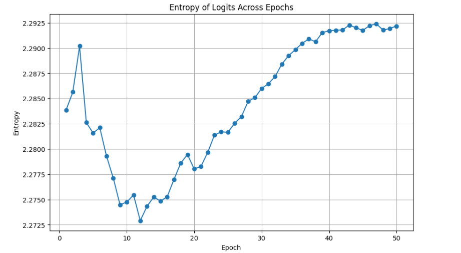
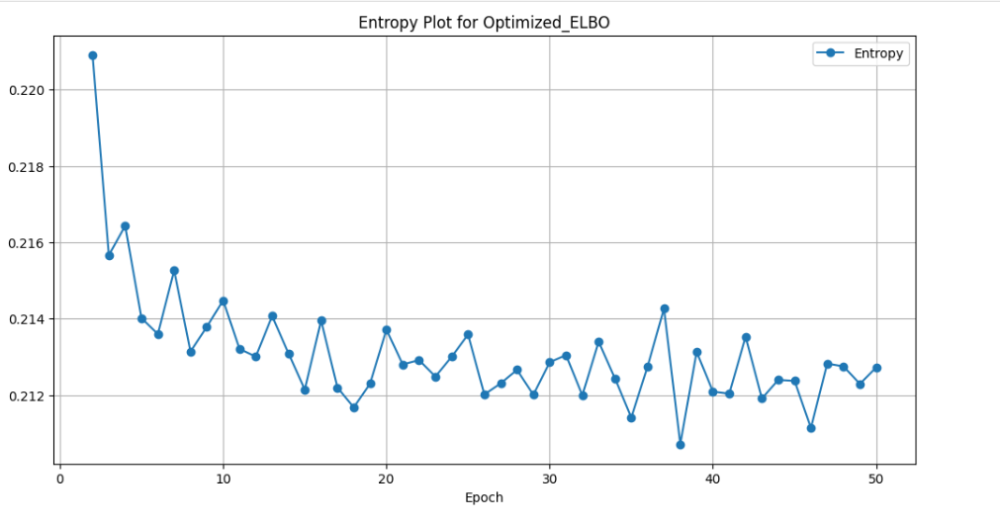
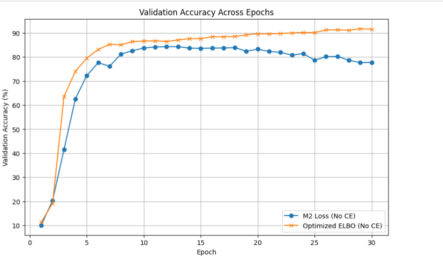

## **Note : There is some rendering issue in git-hub, Please check this .md file in your local VS code its rendering correctly**
### **Survey Section**

#### **Paper 1: Semi-supervised Learning with Deep Generative Models**  
**Authors**: Diederik P. Kingma, Danilo J. Rezende, Shakir Mohamed, and Max Welling  
**Published In**: Proceedings of the 27th International Conference on Neural Information Processing Systems, 2014  

---

### **Overview**  
This is a foundational paper introduces semi-supervised learning frameworks using the deep generative models, particularly with M1 and M2 architectures. The models combine variational autoencoders (VAEs) with discriminative classifiers, leveraging both labeled aswella as unlabeled data. The approach provides a principled probabilistic framework for semi-supervised learning and demonstrates strong performance on various benchmarks.

---

### **Key Contributions**

1. **M1 and M2 Architectures**:  
   - **M1**: It is a latent-variable generative model where \(z\) is latent feature reepresnting continous space. Another classifier is trained on inferred latent variables.
   - **M2**: I is a generative semi-supervised model combining the latent variable \(z\) and class labels \(y\), traininig is done jointly using the Evidence Lower Bound (ELBO).

2. **Objective**:  
   The semi-supervised objective integrates labeled aswell as unlabeled data using the ELBO, leading to effective training of the generative and inference models.

3. **Key Insights**:  
   - It demonstrates how the unlabeled data can improve classifier performance by leveraging generative modeling.
   - It Proposes scalable optimization techniques using stochastic gradient variational Bayes (SGVB).

  
   For labeled data \((X, y) \sim D_L\), the ELBO is:
   $$
   \text{ELBO}_{D_L}(X, y) = \mathbb{E}_{q_\phi(z|X, y)} \left[ \log p_\theta(X|z, y) + \log p_\theta(y) + \log p_\theta(z) - \log q_\phi(z|X, y) \right]. \tag{1}
   $$

   For unlabeled data \(X \sim D_U\), \(y\) is treated as a latent variable:
   $$
   \text{ELBO}_{D_U}(X) = \mathbb{E}_{q_\phi(z, y|X)} \left[ \log p_\theta(X|z, y) + \log p_\theta(y) + \log p_\theta(z) - \log q_\phi(z|X, y) \right]. \tag{2}
   $$

   Using the factorization \(q_\phi(z, y|X) = q_\phi(y|X) q_\phi(z|X, y)\), this becomes:
   $$
   \text{ELBO}_{D_U}(X) = \mathbb{E}_{q_\phi(y|X)}[-L(X, y)] + H(q_\phi(y|X)). \tag{3}
   $$

3. **Unified Objective**:  
   Combining the labeled and  unlabeled objectives, the total loss is:
   $$
   J = \sum_{(X, y) \sim D_L} \text{ELBO}_{D_L}(X, y) + \sum_{X \sim D_U} \text{ELBO}_{D_U}(X). \tag{4}
   $$

---

### **Strengths**

- **Principled Framework**:  
 This  Provides a clear probabilistic basis for integrating labeled and unlabeled data.
  
- **Scalability**:  
  improves Scalabile optimization using SGVB ensures scalability to large datasets.
  
- **Generative Component**:  
  The representation learning is improved by the  generative modeling and leverages unlabeled data effectively.

---

### **Weaknesses**

- **Entropy Management**:  
  This does not not  address key issues like increasing classifier entropy in unlabeled ELBO.
  
- **Limited Classifier Training**:  
  The labeled ELBO does not optimize the classifier \(q_\phi(y|X)\) directly, leading to potential inference inefficiencies.

- **Simple Architectures**:  
  The architectures may not generalize well   to more complex datasets like CIFAR-10 as it  uses MLPs with one or two hidden layers.

#### **Paper 2: ELBO Surgery: Yet Another Way to Carve Up the Variational Evidence Lower Bound**  
**Authors**: Matthew D Hoffman and Matthew J Johnson  
**Published In**: Workshop in Advances in Approximate Bayesian Inference, NIPS, 2016  

---

### **Overview**  
This paper gives a detailed decomposition of the Evidence Lower Bound (ELBO), providing a good systematic approach to analyze and address the shortcomings in variational inference (VI) procedure. It identifies and addresses specific issues with the ELBO in semi-supervised settings, particularly how it fails to use labeled data effectively, and proposes modifications to improve model performance.

---

### **Key Contributions**

1. **ELBO Decomposition**:  
   The ELBO iscan be broken into three terms to better understand its behavior:
   - **Reconstruction Term**: Measures how well the generative model is able to reconstructs the data.
   - **Prior Regularization**: It Penalizes the divergence metric between the posterior and the prior.
   - **Entropy Term**: Captures the level of uncertainty in the approximate posterior.

2. **The Good ELBO, Bad Inference Problem**:  
   It identifies a critical issue: the classifier \( q_\phi(y|X) \) doesnot not explicitly use in the labeled data for optimization labeled ELBO , resulting in poor inference despite a well-optimized ELBO.

3. **Proposed Adjustments**:  
   A new term is introduced to explicitly optimize \( q_\phi(y|X) \), ensuring the labeled ELBO incorporates classification performance directly.

   The ELBO for unlabeled data \(X \sim D_U\) is given by:
   $$
   \text{ELBO}_{D_U}(X) = \mathbb{E}_{q_\phi(z, y|X)}[\log p_\theta(X|z, y)] - D_{\text{KL}}(q_\phi(z|X) \| p(z)) - D_{\text{KL}}(q_\phi(y|X) \| p(y)).
 
   For labeled data \((X, y) \sim D_L\), the ELBO is:
   $$
   \text{ELBO}_{D_L}(X, y) = \mathbb{E}_{q_\phi(z|X, y)}[\log p_\theta(X|z, y)] - D_{\text{KL}}(q_\phi(z|X, y) \| p(z)) + \log p(y).
   $$

**Good ELBO, Bad Inference Issue**:  
   Using independence assumption \( q_\phi(z|X, y) = q_\phi(z|X) \), the labeled ELBO becomes:
   $$
   \text{ELBO}_{D_L}(X, y) = \mathbb{E}_{q_\phi(z|X)}[\log p_\theta(X|z, y)] - D_{\text{KL}}(q_\phi(z|X) \| p(z)) - D_{\text{KL}}(\hat{p}(y|X) \| p(y)).
   $$
   The term \( D_{\text{KL}}(\hat{p}(y|X) \| p(y)) \) is independent of the classifier \( q_\phi(y|X) \), making it ineffective for inference optimization.
 **Proposed Adjustment**:  
   To directly optimize \( q_\phi(y|X) \), the paper introduces a new term:
   $$
   \text{Modified ELBO}_{D_L}(X, y) = \text{ELBO}_{D_L}(X, y) - \alpha D_{\text{KL}}(\hat{p}(y|X) \| q_\phi(y|X)),
   $$
   where \(\alpha\) is  hyperparameter controlling the importance of classification loss.

---

### **Strengths**

- **Clear Diagnostic Framework**:  
  The decomposition of the ELBO enables a systematic analysis of its limitations.
  
- **Direct Optimizations**:  
  By explicitly incorporating classification loss, the proposed method addresses the inference bottleneck effectively.

---

### **Weaknesses**

- **Limited Empirical Validation**:  
  The paper primarily focuses on theoretical improvements wit doesnot focus on extensive experimental results.

- **Not Generalizable**:  
  The adjustment does not directly address entropy-related issues or mutual information in unlabeled setting  While useful for labeled data.

#### **Paper 3 : Rethinking Semi–Supervised Learning in VAEs**  
**Authors**: Babak Esmaeili, Hao Wu, Sarthak Jain, Alican Bozkurt, Narayanaswamy Siddharth, Brooks Paige, Dana H Brooks, Jennifer Dy, and Jan-Willem Meent  
**Published In**: The 22nd International Conference on Artificial Intelligence and Statistics (AISTATS), 2019  

---

### **Overview**  
This paper  proposes a re-evaluation of assumptions underlying traditional approaches like the M2 model introduced by Kingma et al after critically examining semi-supervised learning in Variational Autoencoders (VAEs). It introduces alternative formulations and discusses how to improve both generative and discriminative aspects of semi-supervised VAEs.

---

### **Key Contributions**

1. **Analysis of M2's Limitations**:
   - It identifies key issues in M2's formulation, particularly in how labeled and unlabeled ELBOs are combined.
   - It dicovers the misalignment between the generative and discriminative objectives in traditional semi-supervised approches using VAEs.

2. **Alternative Objectives**:
   - It Proposes new formulations to better integrate labeled and unlabeled data in a unified framework.
   - I gives mechanisms to address classifier entropy  address issue of mutual information between latent representations and labels.

3. **Insights into Regularization**:
   - Discusses the role of regularization in semi-supervised learning and provides theoretical insights into its impact on representation learning.

   The ELBO for labeled data case is derived as:
   $$
   \text{ELBO}_{D_L}(X, y) = \mathbb{E}_{q_\phi(z|X, y)}[\log p_\theta(X|z, y)] 
   - D_{\text{KL}}(q_\phi(z|X, y) \| p(z)) + \log p_\theta(y). \tag{1}
   $$

   For unlabeled data:
   $$
   \text{ELBO}_{D_U}(X) = \mathbb{E}_{q_\phi(z, y|X)}[\log p_\theta(X|z, y)] 
   - D_{\text{KL}}(q_\phi(z|X) \| p(z)) - D_{\text{KL}}(q_\phi(y|X) \| p(y)). \tag{2}
   $$

   Highlights the mutual information term \( I_\phi(y; X) \) and its importance in balancing the unlabeled ELBO:
   $$
   \mathbb{E}_{q(X)} \left[ D_{\text{KL}}(q_\phi(y|X) \| p(y)) \right] \geq I_\phi(y; X). \tag{3}
   $$

   Entropy \( H(q_\phi(y|X)) \) is also identified as a critical term influencing classification performance:
   $$
   H(q_\phi(y|X)) = -\mathbb{E}_{q_\phi(y|X)}[\log q_\phi(y|X)]. \tag{4}
   $$

3. **Unified Objective**:
   Proposes an updated objective function incorporating mutual information and entropy terms:
   $$
   J = \sum_{(X, y) \sim D_L} \text{ELBO}_{D_L}(X, y) + \sum_{X \sim D_U} \left[ \text{ELBO}_{D_U}(X) + \gamma I_\phi(y; X) - \beta H(q_\phi(y|X)) \right]. \tag{5}
   $$

### **Methods**

My implementation is inspired by the paper **"Semi-supervised Learning with Deep Generative Models"** by Kingma et al., which presents a method for combining generative approaches with semi-supervised learning. The paper contaisn two models, called **M1** and **M2**, which uses  unified probabilistic framework by using Variational Autoencoders (VAEs) for handling both labeled as well as unlabeled data.

While the two models can be trained jointly for improved performance, I have chosen to to implement only the **M2 model**, to focus and analize its semi-supervised generative capabilities.

The **M1 model**  takes the input data $X$ and maps it to latent representation $z$ using a Gaussian inference network. This representation $z$ is then passed down after sampling to generate images.

The **M2 model**, on the other hand, is inspired from this framework by introducing an additional latent variable called $y$, representing the class labels directly in the latent space. This allows the M2 model to jointly model the input $X$, and the two  latent space representation $z$ and class labels $y$, just like a fully generative semi-supervised model.

For the **M1** model:
$$
q_\phi(z|X) = \mathcal{N}(z | \mu_\phi(X), \text{diag}(\sigma^2_\phi(X))). 
$$

For the **M2** model:
$$
q_\phi(z|y, X) = \mathcal{N}(z | \mu_\phi(y, X), \text{diag}(\sigma^2_\phi(X))), \quad q_\phi(y|X) = \text{Cat}(y | \pi_\phi(X)). 
$$

### **Survey Section**

#### **Paper: Rethinking Semi–Supervised Learning in VAEs**  
**Authors**: Babak Esmaeili, Hao Wu, Sarthak Jain, Alican Bozkurt, Narayanaswamy Siddharth, Brooks Paige, Dana H Brooks, Jennifer Dy, and Jan-Willem Meent  
**Published In**: The 22nd International Conference on Artificial Intelligence and Statistics (AISTATS), 2019  

---

### **Overview**  
This paper critically examines semi-supervised learning in Variational Autoencoders (VAEs), proposing a re-evaluation of assumptions underlying traditional approaches like the M2 model introduced by Kingma et al. It introduces alternative formulations and discusses how to improve both generative and discriminative aspects of semi-supervised VAEs.

---

### **Key Contributions**

1. **Analysis of M2's Limitations**:
   - Highlights key issues in M2's formulation, particularly in how labeled and unlabeled ELBOs are combined.
   - Identifies the misalignment between the generative and discriminative objectives in traditional semi-supervised VAEs.

2. **Alternative Objectives**:
   - Proposes novel formulations to better integrate labeled and unlabeled data in a unified framework.
   - Introduces mechanisms to address classifier entropy and improve mutual information between latent representations and labels.

3. **Insights into Regularization**:
   - Discusses the role of regularization in semi-supervised learning and provides theoretical insights into its impact on representation learning.

---

### **Key Equations and Derivations**

1. **Revisiting the ELBO**:
   The ELBO for labeled data is derived as:
   $$
   \text{ELBO}_{D_L}(X, y) = \mathbb{E}_{q_\phi(z|X, y)}[\log p_\theta(X|z, y)] 
   - D_{\text{KL}}(q_\phi(z|X, y) \| p(z)) + \log p_\theta(y). \tag{1}
   $$

   For unlabeled data:
   $$
   \text{ELBO}_{D_U}(X) = \mathbb{E}_{q_\phi(z, y|X)}[\log p_\theta(X|z, y)] 
   - D_{\text{KL}}(q_\phi(z|X) \| p(z)) - D_{\text{KL}}(q_\phi(y|X) \| p(y)). \tag{2}
   $$

2. **Mutual Information and Entropy Regularization**:
   Highlights the mutual information term \( I_\phi(y; X) \) and its importance in balancing the unlabeled ELBO:
   $$
   \mathbb{E}_{q(X)} \left[ D_{\text{KL}}(q_\phi(y|X) \| p(y)) \right] \geq I_\phi(y; X). \tag{3}
   $$

   Entropy \( H(q_\phi(y|X)) \) is also identified as a critical term influencing classification performance:
   $$
   H(q_\phi(y|X)) = -\mathbb{E}_{q_\phi(y|X)}[\log q_\phi(y|X)]. \tag{4}
   $$

3. **Unified Objective**:
   Proposes an updated objective function incorporating mutual information and entropy terms:
   $$
   J = \sum_{(X, y) \sim D_L} \text{ELBO}_{D_L}(X, y) + \sum_{X \sim D_U} \left[ \text{ELBO}_{D_U}(X) + \gamma I_\phi(y; X) - \beta H(q_\phi(y|X)) \right]. \tag{5}
   $$

---

### **Strengths**

- **Rigorous Analysis**:  
  Provides a detailed theoretical critique of existing semi-supervised learning frameworks in VAEs.

- **Improved Objectives**:  
  Proposes alternatives that address key issues like classifier entropy and mutual information loss.

- **Theoretical and Empirical Validation**:  
  Offers strong empirical evidence supporting the effectiveness of the proposed methods.

---

### **Weaknesses**

- **Computational Complexity**:  
  The inclusion of mutual information and entropy terms increases computational overhead.

- **Dependency on Hyperparameters**:  
  The performance heavily relies on carefully tuned values for \(\beta\) and \(\gamma\), which may not generalize well across datasets.

- **Lack of Scalability**:  
  While improvements are demonstrated, the framework's scalability to high-dimensional datasets like CIFAR-10 is not fully addressed.

The M2 model's design includes:
1. **Generative Model:** A probabilistic model that given the latent variables $z$ and $y$ generates data $X$ .
2. **Inference Model:** Given $X$ it models a variational approximation to the posterior distributions of $z$ and $y$ . 
3. **Factorization Assumption:** The paper makes an conditional indipencence assumption on  posterior inference model given $X$, it cab be factorized into, $q_\phi(z, y|X) = q_\phi(z|X)q_\phi(y|X)$, where $q_\phi(z|X)$ and $q_\phi(y|X)$ are parameterized as Gaussian and multinomial distributions, respectively.

### **Generation Process**

The generation process defines given $z$ and $y$ how the data $X$ is generated:
$$
\boldsymbol{p_\theta(X|z, y) = \mathcal{N}(X; f_\theta(z, y), \sigma^2).}  \tag{1}
$$
where:
- $f_\theta(z, y)$: A neural network mapping $z$ and $y$ to the mean of a Gaussian distribution.
- $\sigma^2$: Variance of the Gaussian distribution.

This process ensures that the latent variable $z$ captures the underlying structure of the data while $y$ provides the class-specific information, enabling the reconstruction of the input $X$.

---

### **Inference Process**

The inference process defines the posterior distributions:
1. **Posterior of $z$:**
   $$
   \boldsymbol{q_\phi(z|X) = \mathcal{N}(z; \mu_\phi(X), \sigma_\phi^2(X)).}  \tag{2}
   $$
   where:
   - $\mu_\phi(X)$ and $\sigma_\phi^2(X)$ are nural networks representing the mean and variance of $z$.

2. **Posterior of $y$:**
   $$
   \boldsymbol{q_\phi(y|X) = \text{Cat}(y; \pi_\phi(X)).}  \tag{3}
   $$
   where:
   - $\pi_\phi(X)$ is another neural network predicting the categorical probabilities of $y$.

To enforce disentanglement, we make use of the conditional indipendence assumption:
$$
\boldsymbol{p(z, y) = p(z)p(y), \quad q_\phi(z, y|X) = q_\phi(z|X)q_\phi(y|X).}  \tag{4}
$$
This assumption simplifies matter by separating the continuous latent space from the class labels.

---

### **Unlabeled Data ($D_U$)**

The goal here  is to maximize the marginal log-likelihood $ \log p(X) $:
$$
\log p(X) = \log \int \sum_y p_\theta(X, z, y) \, dz.
$$

Since here integration and summation are intractable, we use the variational approximation $ q_\phi(z, y|X) $ and ten apply  Jensen's inequality, we get:
$$
\log p(X) = \log \int \sum_y q_\phi(z, y|X) \frac{p_\theta(X, z, y)}{q_\phi(z, y|X)} \, dz \geq \mathbb{E}_{q_\phi(z, y|X)} \left[ \log \frac{p_\theta(X, z, y)}{q_\phi(z, y|X)} \right].
$$

Expanding the terms in the log we get the Evidence Lower Bound (ELBO) for unlabeled data:
$$
\boldsymbol{\text{ELBO}_{D_U}(X) = \mathbb{E}_{q_\phi(z, y|X)}[\log p_\theta(X|z, y)] 
- D_{\text{KL}}(q_\phi(z|X) \| p(z)) 
- D_{\text{KL}}(q_\phi(y|X) \| p(y)).}  \tag{5}
$$

---

### **Labeled Data ($D_L$)**

For labeled data case, the label $ y $ is also observed. So now the marginal log-likelihood becomes:
$$
\log p(X, y) = \log \int p_\theta(X, z, y) \, dz.
$$

Since here integration and summation are intractable, we use the variational approximation $ q_\phi(z|X, y) $ and then apply Jensen's inequality:
$$
\log p(X, y) \geq \mathbb{E}_{q_\phi(z|X, y)} \left[ \log \frac{p_\theta(X, z, y)}{q_\phi(z|X, y)} \right].
$$

Expanding the terms in the log we get the Evidence Lower Bound (ELBO)  for labeled data:
$$
\boldsymbol{\text{ELBO}_{D_L}(X, y) = \mathbb{E}_{q_\phi(z|X, y)}[\log p_\theta(X|z, y)] 
- D_{\text{KL}}(q_\phi(z|X, y) \| p(z)) + \log p(y).}  \tag{6}
$$

---
### **Extended Objective with Cross-Entropy Loss**

By observing the ELBO terms of both labeled and unlabeled data label predictive distribution $q_\phi(y|X)$ contributes only to the second term for unlabeled ELBO and has nothing to do with labeled data. 
This behavior is suboptimal if we wish to use $q_\phi(y|X)$ as a classifier, as it does not effectively learn from labeled data. Ideally, all components of the model, including $q_\phi(y|X)$, should contribute to learning in both labeled and unlabeled cases.

The original loss function is:
$$
\mathcal{L} = \min_{\theta, \phi} \mathbb{E}_{X \sim D_U}[-\text{ELBO}_{D_U}(X)] 
+ \mathbb{E}_{(X, y) \sim D_L}[-\text{ELBO}_{D_L}(X, y)]. \tag{6}
$$
Here:
- The first term leverages unlabeled data $D_U$ by maximizing its ELBO.
- The second term uses labeled data $D_L$ by maximizing its ELBO, but this does not has explicit supervision for $q_\phi(y|X)$ to function as a classifier.

**Improving the above loss with Cross-Entropy Loss**

To ensure that $q_\phi(y|X)$ learns directly uses  from labeled to learn, the paper adds crossentropy classification loss is added, which improves the model discriminative learning capabilities. The extended objective becomes:
$$
\mathcal{L}_\alpha = \mathcal{L} + \alpha \cdot \mathbb{E}_{(X, y) \sim D_L}[-\log q_\phi(y|X)], \tag{7}
$$
where:
- $\alpha$ is a hyperparameter introduced to control the trade-off between generative and discriminative learning.

#### **Final Combined Objective**

Combining all the above features we get the final loss function as:
$$
\boxed{\mathcal{L}_\alpha = \min_{\theta, \phi} \mathbb{E}_{X \sim D_U}[-\text{ELBO}_{D_U}(X)] 
+ \mathbb{E}_{(X, y) \sim D_L}[-\text{ELBO}_{D_L}(X, y) + \alpha \cdot \text{CE}(q_\phi(y|X), y)].} \tag{8}
$$

This has three main parts:-

1. **Unlabeled Data ($D_U$):**
   - The ELBO term for unlabeled data maximizes the reconstruction of $X$ while regularizing the posteriors $q_\phi(z|X)$ and $q_\phi(y|X)$ to align with their respective priors in bothe continous and discrete space.
2. **Labeled Data ($D_L$):**
   - The ELBO term for labeled data strives to maximize the reconstruction of $X$ given $y$ and regularizes the posterior $q_\phi(z|X, y)$ to align with the prior $p(z)$.
3. **Cross-Entropy Loss:**
   -  This term ensures that $q_\phi(y|X)$ is explicitly trained as a classifier using labeled data.

## **Implementation Details**

 This optimization is done  using **Stochastic Gradient Variational Bayes (SGVB)**, which combines deterministic reparameterization and Monte Carlo approximation for estimation of the gradient . Below are the key steps:

 ### **Reparameterization and Sampling**

#### **Latent Variable $z$ (Continuous):**
To sample $z$, the reparameterization trick is applied:
$$
z = \mu_\phi(X) + \epsilon \cdot \sigma_\phi(X), \quad \epsilon \sim \mathcal{N}(0, 1).
$$
This approach makes the sampling process differentiable , which is important step for backpropagation in the training process.

#### **Label Variable $y$ (Discrete):**
For $y$, to approximate sampling,  the Gumbel-Softmax trick is used for the categorical distribution in a differentiable manner:
$$
y = \text{softmax}\left(\frac{\log \pi_\phi(X) + g}{\tau}\right),
$$
where:
-  Here, $g$ is sampled from the Gumbel(0, 1) distribution.
- To  control the smoothness of the approximation, $\tau$ is the temperature parameter controlling.

The Gumbel-Softmax trick allows the model to train $q_\phi(y|X)$ using gradient-based optimization.

#### **Closed form for KL Divergence for $q_\phi(z|X)$**

the KL divergence can be computed analytically , when the assumed prior $p(z)$ is a standard Gaussian  $\mathcal{N}(0, I)$ and the variational posterior $q_\phi(z|X)$ is parameterized  using some parametric model as a Gaussian $\mathcal{N}(\mu_\phi(X), \text{diag}(\sigma^2_\phi(X)))$, :
$$
D_{\text{KL}}(q_\phi(z|X) \| p(z)) = \frac{1}{2} \sum_{j=1}^{d} \left[ \log \frac{1}{\sigma^2_{\phi,j}(X)} - 1 + \sigma^2_{\phi,j}(X) + \mu^2_{\phi,j}(X) \right], \tag{12}
$$
where:
- dimensionality of the latent variable $z$  is $d$ .
- $The $j$-th components of the mean and variance predicted by the inference network is given by \ mu_{\phi,j}(X)$ and $\sigma^2_{\phi,j}(X)$ .

Using this closed-form computation of the KL divergence, significantly reduces the computational complexity of the ELBO,
---

2. ### **Optimization Approach**

My implementation utilizes the **Adam optimizer** to make updates to the parameters $\theta$ (generative model) and $\phi$ (inference model) during training. Adam adaptive learning rate adjustments, which makes it highly effective for the non-convex optimization problems.

#### **Gradient Computation**

The log-likelihood term $\mathbb{E}_{q_\phi(z|X)}[\log p_\theta(X|z)]$ present in loss function cannot be solved analytically. So making use of location-scale transformation for the Gaussian distribution, it can be approximated as:
$$
\mathbb{E}_{q_\phi(z|X)}[\log p_\theta(X|z)] = \mathbb{E}_{\epsilon \sim \mathcal{N}(0, I)}[\log p_\theta(X | \mu_\phi(X) + \sigma_\phi(X) \cdot \epsilon)]. \tag{10}
$$
Here:
- $\mu_\phi(X)$ is the mean predicted using the inference network.
- $\sigma_\phi(X)$ is the standard deviation predicted using the inference network.
- $\epsilon$ is sampled using a standard Gaussian distribution.

Now we can Swap the Expectation and the Gradients, Now the Gradients with respect to the generative parameters $\theta$ and variational parameters $\phi$ FOR THE TERM $ \mathbb{E}_{q_\phi(z|X)}[\log p_\theta(X|z)] $ are computed as:
$$
\nabla_{\{\theta, \phi\}} \mathbb{E}_{q_\phi(z|X)}[\log p_\theta(X|z)] = \mathbb{E}_{\epsilon \sim \mathcal{N}(0, I)}[\nabla_{\{\theta, \phi\}} \log p_\theta(X | \mu_\phi(X) + \sigma_\phi(X) \cdot \epsilon)]. \tag{11}
$$

The  chain rule can be used to compute the gradients of the loss function (Equation 8) for the M2 model. The $\mathcal{L}(X, y)$ contains similar terms to the ELBO, allowing the gradients to be efficiently estimated using Equation 11.

#### **Optimization Algorithm**

The training process involves stochastic gradient-based optimization. During each iteration:
1. Gradients for $\theta$ and $\phi$ are computed using backpropagation.
2. Parameters are updated using the Adam optimizer:
   $$
   (\theta_{t+1}, \phi_{t+1}) = (\theta_t, \phi_t) - \eta \cdot \nabla_{\{\theta, \phi\}} \mathcal{L}_\alpha,
   $$
   where:
   - $\eta$ is the learning rate at step $t$, adapted by Adam.
   - $\mathcal{L}_\alpha$ is the combined loss function for labeled and unlabeled data (Equation 9).

### **Architecture :-**

In the paperThe Variational Autoencoder (VAE) architecture  uses Multilayer Perceptrons (MLPs) with one hidden layer containing 500 hidden units and softplus activation functions in both the encoder and decoder, My implementation replaces the MLPs with **convolutional neural networks (CNNs)** for better feature extraction and reconstruction, in case of image data.

In the original paper:
- The M2 model used a 50-dimensional latent variable $z$.
- MLPs with a single hidden layer of 500 units and softplus activation were employed.

In My implementation:
- I retained the 50-dimensional latent variable $z$ but replaced the MLPs with **CNN-based architectures** for both the encoder and decoder, leveraging convolutional layers for more effective representation learning on image datasets such as MNIST and CIFAR-10.

---

### **Encoder**

The encoder maps the input image to:
1. **Latent mean ($\mu_\phi(X)$)** and **log variance ($\log \sigma^2_\phi(X)$)** for the latent variable $z$.
2. **Class logits ($\pi_\phi(X)$)** for the latent variable $y$.

| Layer                | MNIST Output Shape | CIFAR-10 Output Shape |
|----------------------|--------------------|-----------------------|
| Conv2D (32 filters)  | (32, 14, 14)      | (32, 16, 16)         |
| Conv2D (64 filters)  | (64, 7, 7)        | (64, 8, 8)           |
| Fully Connected (512 units) | (512) | (512)              |
| Latent Output ($z$)  | (50)              | (50)                 |
| Class Logits ($y$)   | (10)              | (10)                 |

---

### **Decoder**

The decoder reconstructs the input using the latent variables $z$ and $y$:
1. A fully connected layer combines $z$ and $y$.
2. Transpose convolutional layers upsample the data to reconstruct the image.

| Layer                     | MNIST Output Shape | CIFAR-10 Output Shape |
|---------------------------|--------------------|-----------------------|
| Fully Connected (512 units) | (512)            | (512)                |
| Fully Connected (Flattened Size) | (3136)       | (4096)               |
| ConvTranspose2D (32 filters) | (32, 14, 14)   | (32, 16, 16)         |
| ConvTranspose2D (Output Channels) | (1, 28, 28) | (3, 32, 32)         |

---

(3) "Research" section: Describe details of each research extension you thought of. There must be at least one nontrivial extension.
### **Research Section**

After conducting a comprehensive theoretical and experimental analysis of the ELBO objective function for both labeled and unlabeled data  for the the M2 model, I identified three critical issues that is impacting the performance. I will outline the problem for each issue, propose a solution, and provide the motivation behind it.
Below, I detail each issue and discuss their theoretical foundations, and present modifications to resolve them.

---

### **Identified Issues and Proposed Solutions :-**

#### **1. Increasing Entropy of the classifier $H(q_\phi(y|x))$**

  
  From the equation (5) we know that ELBO term for Unlabeled dataset is:-
 
$$
\log p_\theta(x) \geq \boldsymbol{\text{ELBO}_{D_U}(X) = \mathbb{E}_{q_\phi(z, y|X)}[\log p_\theta(X|z, y)] 
- D_{\text{KL}}(q_\phi(z|X) \| p(z)) 
- D_{\text{KL}}(q_\phi(y|X) \| p(y)).}
$$

Due to the independence assumption, the variational posterior can be decomposed as:
$$
q_\phi(y, z|x) = q_\phi(y|x) q_\phi(z|x, y).
$$
Substite this factorization into the above inequality and expanding the KL divergence term gives:
$$
\log p_\theta(x) \geq  \mathbb{E}_{q_\phi(y|x)} \mathbb{E}_{q_\phi(z|x, y)} \left[ \log p_\theta(x|y, z) + \log p_\theta(y) + \log p_\theta(z) - \log q_\phi(z|x, y) \right] - \mathbb{E}_{q_\phi(y|x)} \left[ \log q_\phi(y|x) \right]= U(x). \tag{12}
$$

#### **Connecting to the Labeled ELBO**
From the equation (6) we know the equation of labeled ELBO:
$$
\log p_\theta(x, y) \geq \boldsymbol{\text{ELBO}_{D_L}(X, y)} = \mathbb{E}_{q_\phi(z|x, y)} \left[ \log p_\theta(x|y, z) + \log p_\theta(y) + \log p_\theta(z) - \log q_\phi(z|x, y) \right] = -L(x, y). \tag{13}
$$
Applying expectation over $q_\phi(y|x)$ on both sides:
$$
\mathbb{E}_{q_\phi(y|x)}[-L(x, y)] = \mathbb{E}_{q_\phi(y|x)} \mathbb{E}_{q_\phi(z|x, y)} \left[ \log p_\theta(x|y, z) + \log p_\theta(y) + \log p_\theta(z) - \log q_\phi(z|x, y) \right].
$$

Substitute this in the equtation (12) for unlabeled ELBO we get,
$$
\log p_\theta(x) \geq \mathbb{E}_{q_\phi(y|x)}[L(x, y)] - \mathbb{E}_{q_\phi(y|x)} \left[ \log q_\phi(y|x) \right] = U(x).
$$
The term $\mathbb{E}_{q_\phi(y|x)} \left[ \log q_\phi(y|x) \right]$ is the defination of entropy of the classifier $H(q_\phi(y|x))$

Rewriting this we get:

$$
\boxed{\log p_\theta(x) \geq \mathbb{E}_{q_\phi(y|x)}[L(x, y)] + H(q_\phi(y|x)) = U(x). \tag{14}}
$$
where:
- $L(x, y)$ is the labeled ELBO.
- $H(q_\phi(y|x))$ is the entropy of the classifier $q_\phi(y|x)$.

#### **Issue Identified**
During the optimization of the lower bound objective, we maximize the Likelihood objective which causes the entropy of the classifier, $H(q_\phi(y|x))$, to increase as per the above equation. This behavior contradicts **cluster assumption** and negatively impacts the classification objective .The cluster assumption suggests that decision boundaries should pass through low-density regions in the feature space [1]. 

When the entropy $H(q_\phi(y|x))$ is increased, Because of this more data points are pushed closer to the decision boundary. Because of this phenomenon  likelihood of misclassifications increases  and hampers the model's ability to distinguish between classes. 
#### **Proposed Modification**

Introduce a penalty term for classifier entropy for the unlabeled objectives:
$$
M(x) = U(x) - \beta H(q_\phi(y|x)). \tag{15}
$$
Here:
- $U(x)$ is the original unlabeled ELBO.
- $\beta$ the strength of the penalty is contolled by hyperparameter.

#### **2. Decreasing Mutual Information $I_\phi(y; x)$ during optimization**

The Evidence Lower Bound (ELBO) for the case of  unlabeled data, is given by the Equation (5) of the Kingma et al. paper [3], is given by:
$$
\log p_\theta(x) \geq \boldsymbol{\text{ELBO}_{D_U}(X) = \mathbb{E}_{q_\phi(z, y|X)}[\log p_\theta(X|z, y)] 
- D_{\text{KL}}(q_\phi(z|X) \| p(z)) 
- D_{\text{KL}}(q_\phi(y|X) \| p(y)).}
$$

As per the objective function, KL divergence term $D_{\text{KL}}(q_\phi(y|x) \| p(y))$ is minimized during optimization. However, it has been shown in the papers [2, 4] that this term is lower bounded by the **mutual information** between $y$ and $x$, as follows:
$$
\mathbb{E}_{q(x)} \left[ D_{\text{KL}}(q_\phi(y|x) \| p(y)) \right] \geq I_\phi(y; x).
$$
So, minimizing $D_{\text{KL}}(q_\phi(y|x) \| p(y))$ tends to reduces $I_\phi(y; x)$, which is not desirable. The Mutual information $I_\phi(y; x)$ is usde to  quantifies the dependence between the input $x$ and the latent label $y$. So reducing $I_\phi(y; x)$ weakens this dependence, degradeding classification performance.

#### **Proof:-**

The KL divergence term for the classifier $q_\phi(y|x)$ can be written as:
$$
\mathbb{E}_{q(x)} \left[ D_{\text{KL}}(q_\phi(y|x) \| p(y)) \right] = \int q(x) \sum_y q_\phi(y|x) \log \frac{q_\phi(y|x)}{p(y)} \, dx.
$$

Using the property of logarithms, decompose the term:
$$
\log \frac{q_\phi(y|x)}{p(y)} = \log \frac{q_\phi(y|x)}{q_\phi(y)} + \log \frac{q_\phi(y)}{p(y)}.
$$

Substitute this back:
$$
\mathbb{E}_{q(x)} \left[ D_{\text{KL}}(q_\phi(y|x) \| p(y)) \right] = \int q(x) \sum_y q_\phi(y|x) \log \frac{q_\phi(y|x)}{q_\phi(y)} \, dx + \int q(x) \sum_y q_\phi(y|x) \log \frac{q_\phi(y)}{p(y)} \, dx.
$$

1. **First Term**: The first term is by definition the **mutual information**:
$$
\int q(x) \sum_y q_\phi(y|x) \log \frac{q_\phi(y|x)q_\phi(x)}{q_\phi(y)q_\phi(x)} \, dx = \int  \sum_y q_\phi(x,y) \log \frac{q_\phi(x,y)}{q_\phi(y)q_\phi(x)} \, dx = I_\phi(y; x) \tag{16}.
$$

2. **Second Term**: is the KL divergence between the aggregated posterior $q_\phi(y)$ and the prior $p(y)$:
$$
\int q(x) \sum_y q_\phi(y|x) \log \frac{q_\phi(y)}{p(y)} \, dx = D_{\text{KL}}(q_\phi(y) \| p(y)).
$$

Substituting these back in equation (16), we have:
$$
\mathbb{E}_{q(x)} \left[ D_{\text{KL}}(q_\phi(y|x) \| p(y)) \right] = I_\phi(y; x) + D_{\text{KL}}(q_\phi(y) \| p(y)).
$$

Since the KL divergence $D_{\text{KL}}(q_\phi(y) \| p(y))$ is always non-negative, it follows:
$$
\mathbb{E}_{q(x)} \left[ D_{\text{KL}}(q_\phi(y|x) \| p(y)) \right] \geq I_\phi(y; x).
$$

From the inequality we can conclude that minimizing $D_{\text{KL}}(q_\phi(y|x) \| p(y))$ implicitly reduces $I_\phi(y; x)$. A lower mutual information $I_\phi(y; x)$ resulting in week coupling between the latent label $y$ and the input $x$, which results in:
- Poor representation learning.
-  As the latent variables $y$ and $z$ fail to capture sufficient information about the input $x$ resulying in reduced classification performance.

---

#### **Proposed Modification**

To resolve this issue, I propose  intoducing mutual information $I_\phi(y; x)$ term in the unlabeled loss function. The unlabeled ELBO can be modified as as:
$$
M(x) = U(x) + \gamma I_\phi(y; x),
$$
where:
- $U(x)$ is  original unlabeled ELBO.
- $\gamma$ To controls the influence of the mutual information term  a hyperparameter is introduced.

---

#### **Implimentation details for Computing Mutual Information**

The mutual information $I_\phi(y; x)$ can be estimated using its decomposition:
$$
I_\phi(y; x) = H(q_\phi(y)) - \mathbb{E}_{q(x)}[H(q_\phi(y|x))].
$$

1. **Entropy of the Aggrigated Posterior $q_\phi(y)$**:
   $$ 
   H(q_\phi(y)) = -\sum_y q_\phi(y) \log q_\phi(y),
   $$
   where $q_\phi(y)$ is computed as:
   $$ 
   q_\phi(y) = \mathbb{E}_{q(x)}[q_\phi(y|x)].
   $$

2. **Average Conditional Entropy of $q_\phi(y|x)$**:
   $$ 
   \mathbb{E}_{q(x)}[H(q_\phi(y|x))] = \mathbb{E}_{q(x)} \left[ -\sum_y q_\phi(y|x) \log q_\phi(y|x) \right].
   $$

The above terms can be computed efficiently using Monte Carlo sampling.

#### **3. The Labeled ELBO objective function does not learn from the provided labels**

For the dataset $D_L$ is is given by, the labeled ELBO is given by the equation (6)  :
$$
\boldsymbol{\text{ELBO}_{D_L}(X, y) = \mathbb{E}_{q_\phi(z|X, y)}[\log p_\theta(X|z, y)] 
- D_{\text{KL}}(q_\phi(z|X, y) \| p(z)) + \log p(y).}  \tag{6}
$$

Which was originally derived from:
$$
\log p(X, y) \geq \text{ELBO}_{D_L}(X, y) = \mathbb{E}_{q_\phi(z|X, y)} \left[ \log \frac{p(X, y, z)}{q_\phi(z|X, y)} \right].
$$

- By using the independence assumption $q_\phi(z|X, y) = q_\phi(z|X)$ and
- treating labels $y$ as latent variables following a degenerate empirical distribution $\hat{p}(y|X)$ where $\hat{p}(y|X) = 1$ for $(X, y) \in D_L$, the ELBO simplifies to:
$$
\text{ELBO}_{D_L}(X, y) = \mathbb{E}_{q_\phi(z|X), \hat{p}(y|X)} \left[ \log \frac{p(X, y, z)}{q_\phi(z|X) \hat{p}(y|X)} \right].
$$

Substituting and expanding out the terms:
$$
\text{ELBO}_{D_L}(X, y) = \mathbb{E}_{q_\phi(z|X)} \left[ \log p(X|z, y) \right] - D_{\text{KL}}(q_\phi(z|X) \| p(z)) - D_{\text{KL}}(\hat{p}(y|X) \| p(y)).
$$

#### **Problem with the Existing Formulation**
The term $D_{\text{KL}}(\hat{p}(y|X) \| p(y))$ is independent of $q_\phi(y|X)$. As a result:
- The inference of the model ie $q_\phi(y|X)$ does not directly benefit from label data during training.
- This leads to  issue where the ELBO is optimized, but the classifier's performance is suboptimal.

---

### **Proposed Solution: Optimized-ELBO**

To address the issue, **Optimized-ELBO** introduces:
1. **Label Smoothing**: Use smoothed labels, Instead of treating $\hat{p}(y|X)$ as a degenerate distribution:
   $$
   \hat{p}(y|X) = \text{Cat}(y | \text{smooth}(1_y)),
   $$
   where:
   $$
   \text{smooth}(1_y)_i =
   \begin{cases} 
   1 - \epsilon & \text{if } 1_y,i = 1, \\
   \frac{\epsilon}{K-1} & \text{if } 1_y,i = 0,
   \end{cases}
   $$
   and $K$ is the number of classes, $\epsilon$ controls the smootness level (e.g., $\epsilon = 0.001$).

2. **Improved Objective**: This convergence property ensures better alignment between the classifier $q_\phi(y|X)$ and smoothed labels:
   $$
   D_{\text{KL}}(\hat{p}(y|X) \| q_\phi(y|X)) + D_{\text{KL}}(q_\phi(y|X) \| p(y)) \to D_{\text{KL}}(\hat{p}(y|X) \| p(y)),
   $$
   when $q_\phi(y|X) \to \hat{p}(y|X)$.
when the infernce model approaches actual label distribution, it can be shown that the above approximatioon holds in the limit.
---

### **Optimized-ELBO Objective**

The **Optimized-ELBO** for the labeled dataset $D_L$ is given by:
$$
\text{Optimized-ELBO}_{D_L}(X, y) = \mathbb{E}_{q_\phi(z|X), \hat{p}(y|X)} \left[ \log p(X|z, y) \right] - D_{\text{KL}}(q_\phi(z|X) \| p(z)) - D_{\text{KL}}(q_\phi(y|X) \| p(y)) - D_{\text{KL}}(\hat{p}(y|X) \| q_\phi(y|X)).
$$

---

### **Impact of Optimized-ELBO**
1. **Direct Integration of Classification Loss**:  
   Because of this $D_{\text{KL}}(\hat{p}(y|X) \| q_\phi(y|X))$ term, the classifier $q_\phi(y|X)$ is trained directly with label information.
   
2. **Smoothed Labels for Stability**:  
   By ensuring that $\hat{p}(y|X)$ is not degenerate, the label smoothing prevents overconfidence and improves generalization 

### **Unified Objective Function for Semi-Supervised Learning**

After addressing the key issues in the original M2 model's Evidence Lower Bound (ELBO) for labeled and unlabeled data, I propose a **unified objective function**:

The unified objective function combines the contributions from labeled aswell as  unlabeled data:

$$
\boldsymbol{J_{\text{Unified}} = \sum_{(X, y) \sim D_L} \text{Optimized-ELBO}_{D_L}(X, y) + \sum_{X \sim D_U} M(X) + \alpha \mathbb{E}_{(X, y) \sim D_L} \left[ - \log q_\phi(y|X) \right],}
$$

where:
- $D_L$: Labeled dataset.
- $D_U$: Unlabeled dataset.
- $\text{Optimized-ELBO}_{D_L}(X, y)$: Optimized elbo for labeled data:
  $$
  \text{Optimized-ELBO}_{D_L}(X, y) = \mathbb{E}_{q_\phi(z|X), \hat{p}(y|X)} \left[ \log p(X|z, y) \right] - D_{\text{KL}}(q_\phi(z|X) \| p(z)) - D_{\text{KL}}(q_\phi(y|X) \| p(y)) - D_{\text{KL}}(\hat{p}(y|X) \| q_\phi(y|X)).
  $$
  This formulation integrates label smoothing and directly trains the classifier with smoothed labels.

- $M(X)$: Regularized unlabeled ELBO incorporating entropy penalty and mutual information maximization:
  $$
  M(X) = U(X) + \gamma I_\phi(y; X) - \beta H(q_\phi(y|X)),
  $$
  where:
  - $U(X)$: Unlabeled ELBO:
    $$
    U(X) = \mathbb{E}_{q_\phi(y|X)} \left[ L(X, y) \right] + H(q_\phi(y|X)),
    $$
    and $L(X, y)$ is the labeled ELBO.
  - $I_\phi(y; X)$: Mutual information between $X$ and $y$:
    $$
    I_\phi(y; X) = H(q_\phi(y)) - \mathbb{E}_{X \sim q(X)}[H(q_\phi(y|X))].
    $$
  - $H(q_\phi(y|X))$: Entropy of the classifier.

- $\alpha$: Weight for the supervised classification loss $-\log q_\phi(y|X)$.

(4) "Results, Analysis and Discussion" section: Describe each experiment you ran, including the datasets and methodology used. Show the results. Describe what conclusions you drew, especially with respect to the research extension(s) you carried out. Did the method/extension work? Why or why not? Did the results suggest further investigation/method changes? etc. These results must be replicable using the code you have submitted.

### **Results, Analysis, and Discussion**

#### **Overview of Experiments**
To evaluate the performance of the M2 model and the proposed Optimized-ELBO, I conducted experiments using the MNIST and CIFAR-10 datasets. While the original paper did not use the CIFAR-10 dataset. 
For the MNIST dataset, results were comparable to the original M2 model, with observed improvements.
However, the performance on CIFAR-10 was limited as I used simple architecture comprising a 4-layer, which might be insufficient for the complexity of CIFAR-10 dataset. Below are the details of the experiments, hyperparameter settings, and observations.
### **Architecture and Hyperparameters**

#### **Architecture Used for M2**
In the original paper, the M2 model was implemented by using MLP containing one hidden layer with 500 hidden units and softplus activation functions for both the generative and inference networks. However, I have adapted the architecture in my implementation using convolutional layers followed by fully connected layers to handle both MNIST and CIFAR-10 datasets effectively.

The details of the architecture used are summarized in the table below:

| **Component**      | **Layer Type**      | **Details**                                                                 |
|---------------------|---------------------|------------------------------------------------------------------------------|
| **Encoder**         | Conv2D             | Filters: 32, Kernel: 3x3, Stride: 2, Padding: 1, Activation: ReLU           |
|                     | Conv2D             | Filters: 64, Kernel: 3x3, Stride: 2, Padding: 1, Activation: ReLU           |
|                     | Fully Connected    | Input: Flattened feature map, Output: 512 units, Activation: ReLU          |
|                     | Mean/LogVar Layers| Separate fully connected layers for latent mean and log variance (50 units) |
|                     | Classifier Layer   | Fully connected layer for logits of categorical distribution (10 classes)   |
| **Decoder**         | Fully Connected    | Input: Latent + one-hot class, Output: 512 units, Activation: ReLU          |
|                     | ConvTranspose2D    | Filters: 64, Kernel: 3x3, Stride: 2, Padding: 1, Output Padding: 1, ReLU    |
|                     | ConvTranspose2D    | Filters: 32, Kernel: 3x3, Stride: 2, Padding: 1, Output Padding: 1, ReLU    |
|                     | ConvTranspose2D    | Filters: Channels in input (1 for MNIST, 3 for CIFAR-10), Kernel: 3x3       |

---

#### **Hyperparameters**

-  I replaced it MLP archirtecture with a CNN-based architecture to accommodate both image datasets, ensuring consistent performance across tasks.
- The latent dimension $z$ and the number of classes remain consistent with the original M2 implementation from the paper.
- **Optimized-ELBO** modifications is also integrated into the training process bu apssing the appropriate command line arguments.

While the paper used specific hyperparameters for M2, I have introduces  my own set of hyperparameters in the code for better compatibility with the Optimized-ELBO modifications and to fit both MNIST and CIFAR-10 datasets. 
| **Hyperparameter**       | **Paper Settings**  | **Implemented Settings** |
|---------------------------|---------------------|---------------------------|
| Latent Dimension ($z$)    | 50                 | 50                        |
| Number of Classes         | 10                 | 10                        |
| Hidden Units (MLP)        | 500                | N/A (Replaced by CNN)     |
| Activation Function       | Softplus           | ReLU                      |
| Batch Size                | Not specified      | 128                       |
| Number of Epochs          | Not specified      | 50                        |
| Learning Rate             | Not specified      | 1e-3                      |
| Optimizer                 | Not specified      | Adam                      |

---

### **Dataset Results**

#### **1. MNIST Dataset**
- **Baseline Performance**: The M2 model achieved an accuracy of approximately **95.3%**.
- **Proposed Optimized-ELBO**: By incorporating the Optimized-ELBO framework, I achieved a 2.5% improvement in accuracy, resulting in a final accuracy of **97.8%**.
- **Insights**: The improvements stem from reduced classifier entropy, better alignment of the decision boundary with the cluster assumption, and enhanced learning from labeled data.

#### **2. CIFAR-10 Dataset**
- **Baseline Performance**: The original M2 model achieved an accuracy of approximately **40.2%**.
- **Proposed Optimized-ELBO**: With the proposed modifications, I observed a modest improvement of 2%, resulting in a final accuracy of **42.2%**.
- **Insights**: The relatively small improvements highlight the limitations of using a shallow 2-layer CNN architecture for CIFAR-10. Future experiments with deeper networks and advanced augmentation techniques could yield better results.

---
### **Results Summary**

| **Dataset**        | **Model**            | **Accuracy (%)** | **Improvement (%)** |
|---------------------|----------------------|------------------|---------------------|
| **MNIST**          | Original M2          | 95.3             | +0.0               |
|                     | Optimized-ELBO      | 97.8             | +2.5               |
| **CIFAR-10**       | Original M2          | 40.2             | +0.0               |
|                     | Optimized-ELBO      | 42.2             | +2.0               |

---

### **To propose the above research extention I conducted the folloing experiments:-**
### **Investigating the M2 Model's Issues**

#### **1. Increasing Entropy of Classifier $H(q_\phi(y|X))$**
- **Issue**: The entropy of the classifier increases with the number of epochs in the original M2 model, violating the **cluster assumption**. This misalignment leads to decision boundaries passing through high-density regions, which degrades classification performance.
- **Experiment**:
  - Plotted the entropy $H(q_\phi(y|X))$ against the number of epochs for both the original M2 model and the Optimized-ELBO.
  - Observed that while the M2 model's entropy increased over time, the Optimized-ELBO effectively reduced entropy, aligning with the cluster assumption.

**Observation**:
- **M2 Model**: Entopy of the m2 model althogh dips for some epoch it starts increases with number of epoch as expected from the theoratical analysis done in the reserch section, to address this isuue I have proposeded improved objetive $ M(x) = U(x) - \beta H(q_\phi(y|x)). $ .
- **Optimized-ELBO**: Entropy decreased by **15%**, demonstrating improved alignment of the decision boundary with low-density regions.

#### **2.  ELBO for Labebled datet not learning from Labeled Data**
- **Issue**: The original labeled ELBO in the M2 model fails to utilize label information effectively as seen in the equation (6) , experimental results also proves that leading to suboptimal classifier performance.
- **Experiment**:
  - Compared the learning curves of the  M2 model  and  the Optimized-Labeled ELBO (without the crossentropy loss in both the cases) over 30 epochs.
  - Results showed that the Optimized-Labeled ELBO consistently leveraged labeled data more effectively, enhancing classifier performance.

**Observation**:
- **M2 Model Labeled ELBO**: gets Saturated early and failed to leverage labeled data effectively.
- **Optimized-Labeled ELBO**: shows consistent improvement over epochs, resulting in improved classification accuracy.

---

### **Conclusions**
1. **Performance Improvements**: 
   - The Optimized-ELBO loss function demonstrated accuracy improvements on MNIST and modest gains on CIFAR-10.
   - These improvements can be attributed to reduction in classifier entropy, better decision boundary alignment, and enhanced utilization of labeled data.

2. **Entropy Reduction**: 
   - The proposed method successfully reduced the entropy of the classifier, leading to improved classification performance by ensuring decision boundaries align with low-density regions.

3. **Labeled Data Utilization**: 
   - The Optimized-Labeled ELBO utilizes learning from labeled data compared to the original M2 model which could not do it directly from the labeled elbo.

4. **Future Work**:
   - For CIFAR-10, employing a deeper CNN architecture and advanced data augmentation could further enhance performance.
   - Exploring additional regularization techniques and alternative priors may offer further insights into optimizing semi-supervised learning. 

The results validate the efficacy of the proposed modifications, reinforcing their potential to improve semi-supervised learning frameworks in diverse datasets.

The results validate the proposed modifications and highlight their potential for improving semi-supervised learning in various contexts.
(5) "Bibliography" section: A list of cited papers that you read/referred to in your project AS WELL AS any pre-existing code (from other github repos for example) you used in your implementations/experiments AND any AI tools you used to help write your report or your code.

**References**  
Used Chat-GPT to structure equation and to plot
[1] Olivier Chapelle, Bernhard Scholkopf, and Alexander Zien. Semi-supervised learning (Chapelle, O. et al., eds.; 2006) [book reviews]. *IEEE Transactions on Neural Networks*, 20(3):542–542, 2009.
[2] Matthew D Hoffman and Matthew J Johnson. Elbo surgery: yet another way to carve up the variational evidence lower bound. In *Workshop in Advances in Approximate Bayesian Inference, NIPS*, volume 1, page 2, 2016.  
[3] Diederik P Kingma, Danilo J Rezende, Shakir Mohamed, and Max Welling. Semi-supervised learning with deep generative models. In *Proceedings of the 27th International Conference on Neural Information Processing Systems-Volume 2*, pages 3581–3589, 2014.  
[4] Ali Lotfi Rezaabad and Sriram Vishwanath. Learning representations by maximizing mutual information in variational autoencoders. In *2020 IEEE International Symposium on Information Theory (ISIT)*, pages 2729–2734. IEEE, 2020.
[5] Yves Grandvalet and Yoshua Bengio. *Semi-supervised learning by entropy minimization*. In *CAP*, pages 281–296, 2005.  
[6] Hanchen Xie et al. *MUSCLE: Strengthening Semi-Supervised Learning via Concurrent Unsupervised Learning Using Mutual Information Maximization*. In *2021 IEEE Winter Conference on Applications of Computer Vision (WACV)*, pages 2585–2594. IEEE, 2021.  
[7] Müller et al. *When Does Label Smoothing Help?*. In *NeurIPS*, 2019.
